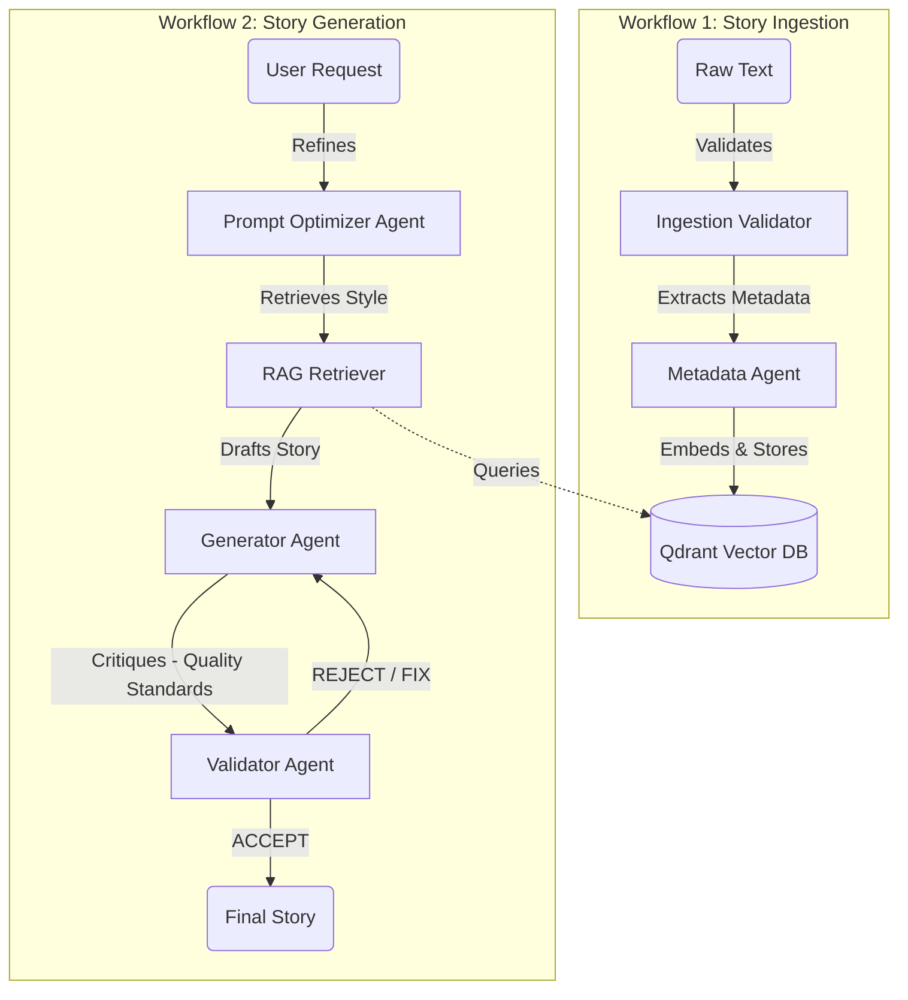

# Telugu Agentic RAG System (AI Storyteller)

> **The first "Cognitive Architecture" for High-Quality Telugu Literature.** 🧠📚

High-quality Telugu storytelling is notoriously difficult for AI due to linguistic nuance and stylistic drift. This project solves that by transforming the generation process from a **Single-Shot Draft** (Monolithic) into a **Multi-Stage Agentic Loop** (Plan → Draft → Critique → Polish).

---

## 🚀 The Core Philosophy: "Agentic" vs. "Monolithic"

Why is this system better than the old **Chandamama Studio**?

| Feature | 🏛️ Monolithic Approach (Old) | 🤖 Agentic Approach (New) |
| :--- | :--- | :--- |
| **Workflow** | **Linear**: Input -> LLM -> Draft. If the plot wanders, you're stuck with it. | **Cyclic**: Plan -> Draft -> **Critique Loop** -> Polish. The system *self-corrects*. |
| **Cognition** | **Reactive**: The LLM reacts to the prompt immediately. | **Deliberate**: An "Optimizer Agent" first plans the narrative arc before writing a single word. |
| **Quality Control** | **Manual**: You, the user, must spot errors and vague writing. | **Autonomous Validator**: A specialized "Editor Agent" critiques the draft for *Show-Don't-Tell* and *Pacing* issues, rejecting bad drafts automatically. |
| **Language Model** | **Generalist**: Often produces "Translated English" (Bookish Telugu). | **Specialized**: Enforces a "Think in Telugu" protocol to prioritize native idioms and rhythm. |

---

## 🌟 How It Works: The "Quality Loop"

The secret to generating "quite good" stories isn't just a better prompt—it's the **Architecture**.

### 1. The Planner (Prompt Optimizer)
Before writing begins, the **Optimizer Agent** analyzes your request. It doesn't just pass keywords; it expands them into a tailored blueprint, ensuring the model understands the *intent*, tone, and required narrative structure.

### 2. The Drafter (RAG Generator)
The **Generator Agent** writes the story, but it doesn't write in a vacuum. It uses **Retrieval Augmented Generation (RAG)** to pull specific *stylistic examples* from our curated archive. If you ask for a "Tenali Rama" style story, it retrieves actual excerpts to ground its tone in authenticity.

### 3. The Editor (Validator Agent) – *Crucial Step*
This is where the magic happens. The draft is NOT shown to you immediately. It is passed to a strict **Validator Agent** (acting as a Senior Editor). This agent critiques the story against rigorous literary standards:

*   **Show, Don't Tell**: Flagging "lazy" descriptions (e.g., "Raju was greedy") and demanding action-based intros.
*   **Pacing & Arc**: Ensuring character transformation happens gradually, not instantly.
*   **Logical Consistency**: Checking that actions have realistic consequences.
*   **No Preaching**: Ensuring the story *is* the lesson, rather than characters lecturing the moral.

If the draft fails these checks, the Validator sends it back to the Drafter with specific fix instructions. **This loop repeats until the story meets quality standards.**

---

## 🏗️ System Architecture



### 🧩 The Agent Roster

Every agent has a specific job in this cognitive assembly line.

| Workflow | Agent | Responsibility |
| :--- | :--- | :--- |
| **Ingestion** | **Ingestion Validator** | Checks if raw text is valid Telugu and long enough. |
| **Ingestion** | **Metadata Agent** | Extracts Genre, Themes, and Keywords for better search. |
| **Ingestion** | **Ingestion Agent** | Backs up to Mongo, embeds text (GTE), and pushes to Qdrant. |
| **Generation** | **Prompt Optimizer** | "The Planner." Expands simple user requests into detailed blueprints. |
| **Generation** | **RAG Retriever** | "The Librarian." Fetches similar stories to use as style references. |
| **Generation** | **Generator Agent** | "The Writer." Drafts the story following the blueprint and style guide. |
| **Generation** | **Validator Agent** | "The Editor." Critiques the draft against 8 literary standards and demands fixes. |

---

## 🛠️ Installation & Setup

### 1. Requirements
- Python 3.10+
- **Google Gemini API Key** (or OpenAI/Groq)

### 2. Quick Start (Streamlit Cloud Ready)
This project uses a simple `requirements.txt` structure for easy deployment.

```bash
# Clone the repository
git clone <repo-url>
cd telugu-agentic-rag

# Setup Environment
cp .env.example .env
# Open .env and add your GOOGLE_API_KEY

# Install Dependencies
pip install -r requirements.txt

# Run the App
streamlit run app.py
```

---


---

## 🤝 How to Contribute

We welcome improvements to the "Brain" of the system!

### 1. Improving the Storyteller (Prompt Engineering)
- **File**: `src/utils/generation_utils.py`
- **Goal**: Make stories more culturally authentic.
- **Action**: Tweak the `generate_story` function to adjust the "Planner" blueprint or "Drafter" style instructions.

### 2. Sharpening the Editor (Validator Logic)
- **File**: `src/agents/wf2_generation/validator_agent.py`
- **Goal**: Catch more errors (e.g., Passive Voice, English Idioms).
- **Action**: Add new checks to the `validate` method. If you find a common AI mistake, write a rule to catch it!

### 3. Adding New Agents
- Create a new agent in `src/agents/`.
- Inherit from `BaseAgent`.
- Register it in the workflow.

See `CONTRIBUTING.md` for full coding guidelines.

---
**License**: AGPL-3.0
