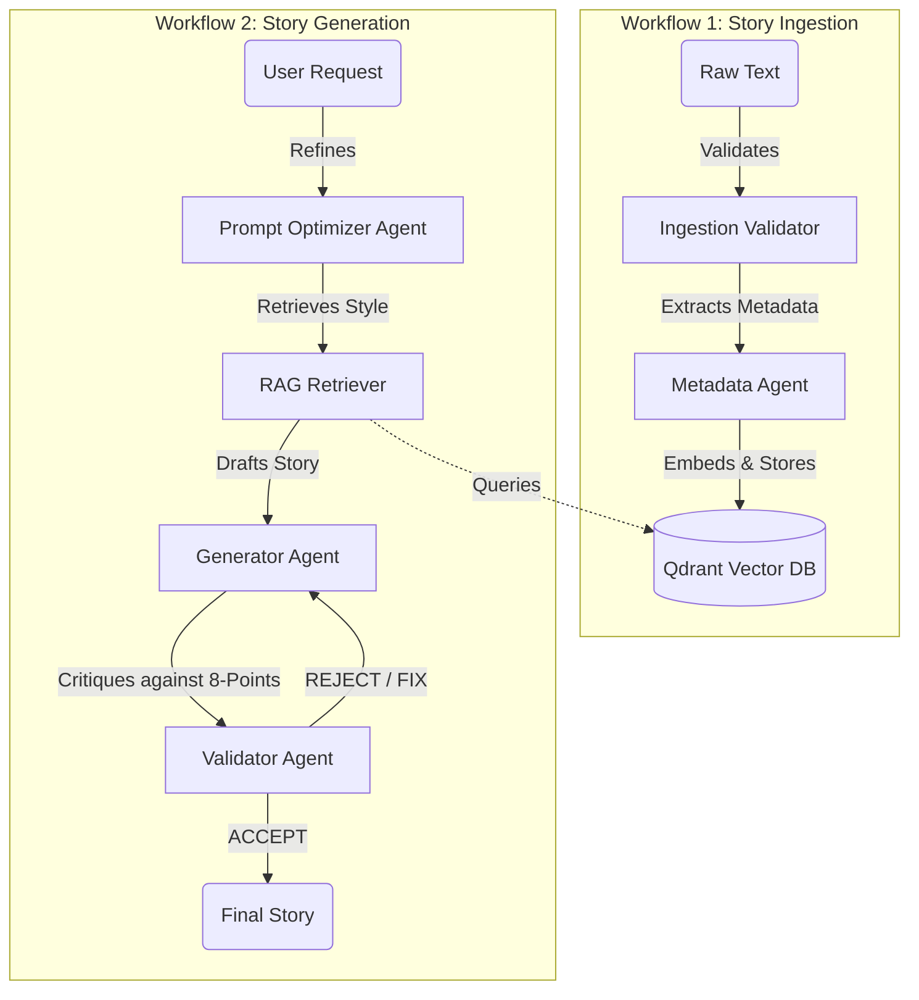

# Telugu Agentic RAG System (AI Storyteller)

An advanced **Multi-Agent AI System** designed to generate high-quality, culturally nuanced Telugu stories. This system evolves the pioneering **Chandamama Studio** from a *Linear RAG Pipeline* into a **Cognitive Architecture**.

---

## 🚀 Why "Agentic" RAG? (vs. Old Monolithic Approach)

The transition from **Chandamama Studio (Monolithic)** to **Agentic RAG** represents a paradigm shift in AI storytelling.

## 🚀 Why "Agentic" RAG? (vs. Chandamama Studio)

The **Chandamama Studio** was a pioneering *Linear RAG* application. This new **Agentic System** evolves it into a *Cognitive Architecture*.

| Feature | 🏛️ Chandamama Studio (Legacy) | 🤖 Agentic RAG (New System) |
| :--- | :--- | :--- |
| **Workflow** | **Linear**: Retriever -> LLM -> Output. | **Cyclic**: Plan -> Draft -> **Critique (Loop)** -> Polish. |
| **Quality Control** | **Manual**: If the output is bland, you must manually prompt again. | **Autonomous Validator**: A specialized "Editor" Agent audits the story against 8 strict rules and **fixes it automatically** before you see it. |
| **Planning** | **Direct**: User Prompt immediately triggers generation. | **Cognitive**: A "Prompt Optimizer" Agent first expands your request into a detailed narrative blueprint. |
| **Language** | **Translation-Heavy**: Often sounded like translated English. | **"Think in Telugu"**: Enforces native thinking and idiom usage via the "8 Commandments". |
| **Resilience** | **Script-Based**: Single error stops the process. | **Graph-Based**: Agents can retry specific steps (e.g., re-generate just the ending) without restarting. |

---

## 🛡️ The "8 Commandments" of Quality

This system doesn't just "write stories"; it adheres to a strict literary code enforced by the **Validator Agent**:

1.  **Show, Don't Tell**: Characters are introduced via **ACTION**, not trait dumping (e.g., *No "Raju is greedy". Show Raju snatching a coin.*).
2.  **Gradual Arcs**: Character transformation must follow a 4-stage path (Resistance -> Doubt -> Change -> Growth).
3.  **No Preaching**: "Double Morals" are banned. The story *is* the lesson; characters do not lecture.
4.  **Logical Consequences**: No "magical" fixes. Actions have real weight.
5.  **Object Permanence**: Items introduced must remain consistent in physics and utility.
6.  **Varied Sentence Structure**: No repetitive "Name... Name..." sentence starts.
7.  **Functional Description**: Atmosphere must serve the plot, not just decorate.
8.  **Earned Resolution**: Endings must be a result of character choice, not luck.

---

## 🧩 The Agent Team

1.  **Ingestion Agent**: Reads raw Telugu stories, cleans them, extracts metadata, and stores them in **Qdrant** (Vector DB).
2.  **Prompt Optimizer Agent**: "Thinks" about your request and expands it into a detailed blueprint before writing starts.
3.  **RAG Generator Agent (The Storyteller)**: Retrieves similar stories for style reference and drafts the narrative using the "Think in Telugu" safeguards.
4.  **Validator Agent (The Editor)**: The harshest critic. It reads the draft, checks the 8 Commandments, and auto-corrects minor issues or rejects major failures.

---


---

## 🏗️ Architecture



---

## 🛠️ Installation & Setup

### 1. Requirements

- Python 3.10+
- **Google Gemini API Key** (or OpenAI/Groq)

### 2. Quick Start (Streamlit Cloud Ready)

This project uses a simple `requirements.txt` structure for easy deployment.

```bash
# Clone the repository
git clone <repo-url>
cd telugu-agentic-rag

# Setup Environment
cp .env.example .env
# Open .env and add your GOOGLE_API_KEY

# Install Dependencies
pip install -r requirements.txt

# Run the App
streamlit run app.py
```

### 3. Folder Structure

- `src/agents/`: The brains of the operation (Ingestion, Generation, Validation).
- `src/utils/`: Helper functions and the core `generation_utils.py` (Prompt Templates).
- `data/`: Local storage for vector chunks (excluded from git).
- `app.py`: The Main Interface.

---

## 🤝 Contributing

We welcome contributions regarding **Prompt Engineering** and **Dataset Expansion**.
See `CONTRIBUTING.md` for details.

---

**License**: AGPL-3.0
