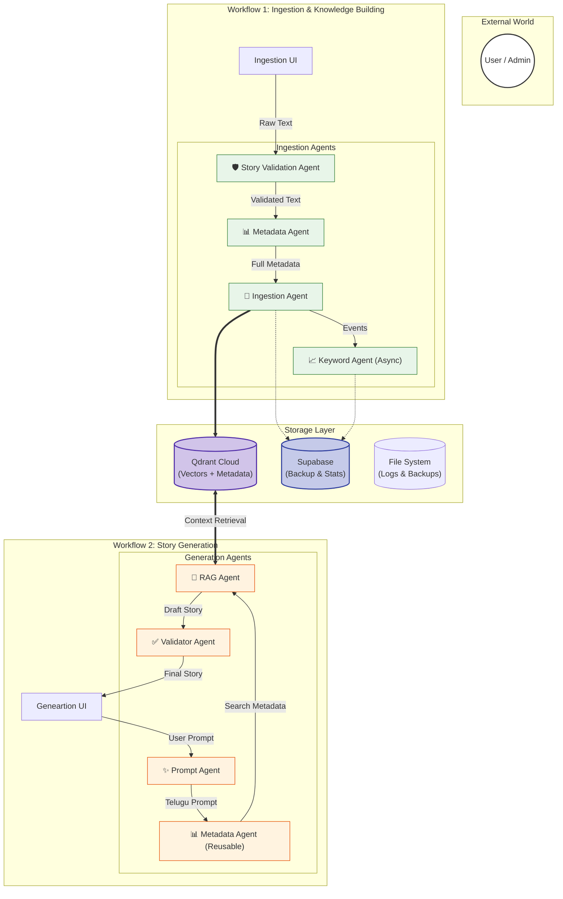
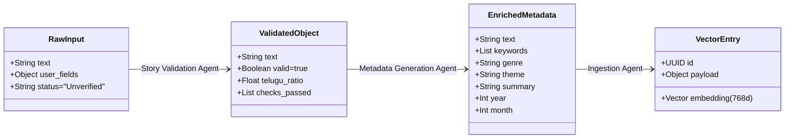
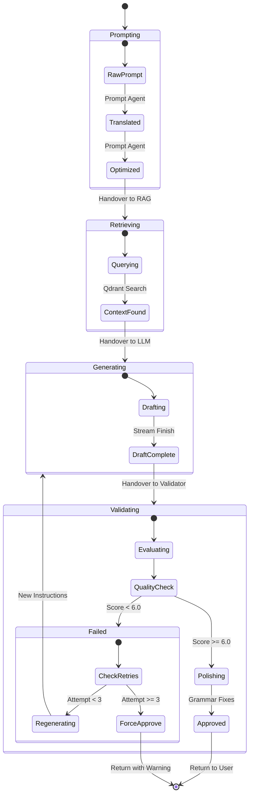
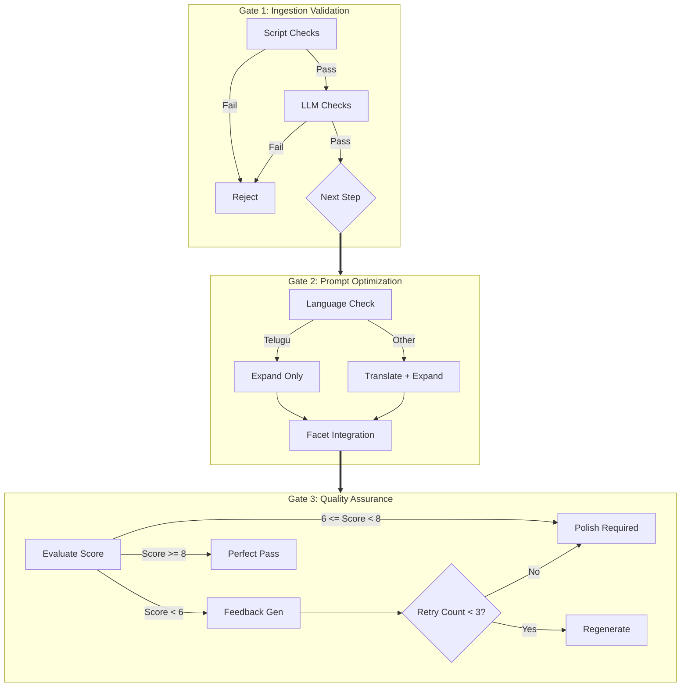

# Master Architecture & Flow Diagrams

> **Visual reference for the complete Telugu Agentic RAG System**

This document provides high-fidelity diagrams for the entire system, connecting Ingestion (Workflow 1) and Generation (Workflow 2).

---

## 1. Unified System Architecture

This diagram shows how both workflows connect through the shared storage layer.

---

## 2. Ingestion Data Pipeline (Data Transformation)

Shows how data transforms from raw text to a vector point.

---

## 3. Story Generation State Machine

Shows the lifecycle of a story request, including the regeneration loop.

---

## 4. Agent Decision Gates

Visualizing the "Brain" of the system: where decisions are made.

